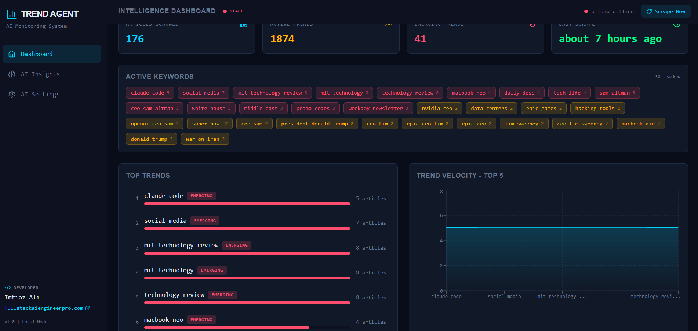
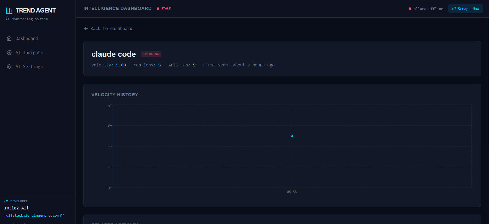
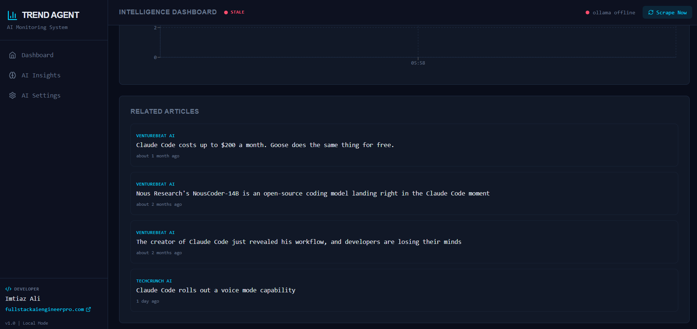
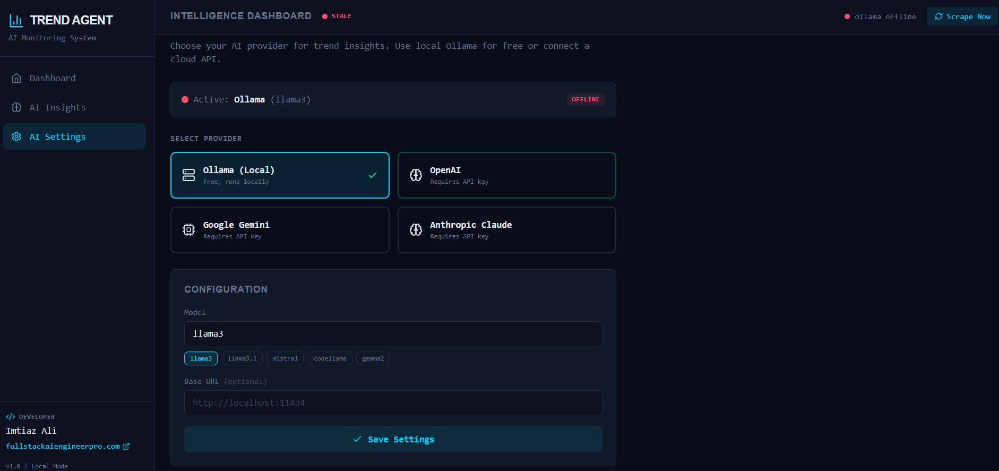

# AI Web Monitoring & Trend Detection Agent

A multi-agent AI platform that performs automated web monitoring, trend detection, and insight generation using Python, FastAPI, and a Next.js dashboard.

Continuously scrapes 10+ AI & Technology news sources, detects emerging trends using keyword frequency and velocity analysis, and generates AI-powered insights - all presented on a real-time dark-themed dashboard.

**Works 100% locally with Ollama, or connect your own cloud AI (OpenAI, Gemini, Anthropic).**

---

## Screenshots

### Dashboard - KPI Stats, Active Keywords & Top Trends


### Trend Detail - Velocity History & Metadata


### Trend Detail - Related Articles


### AI Settings - Multi-Provider Configuration


---

## Features

- **Automated RSS Scraping** - Fetches from 10 pre-configured AI/tech news feeds every 30 minutes
- **YAKE Keyword Extraction** - Extracts multi-word keyphrases and tracks mention velocity
- **Trend Classification** - Categorizes trends as Emerging, Rising, Stable, or Declining
- **Multi-Provider AI Insights** - Generate trend briefings using Ollama, OpenAI, Gemini, or Anthropic
- **Real-Time Dashboard** - Auto-refreshing stats, interactive charts, active keyword cloud
- **Trend Deep Dive** - Click any trend to see velocity history and related articles
- **One-Click Actions** - Manual scrape trigger, on-demand insight generation
- **Zero Setup Database** - SQLite auto-creates on first run, no configuration needed

---

## Prerequisites

- Python 3.11+
- Node.js 18+
- Ollama ([ollama.com](https://ollama.com)) - optional, for free local AI insights

## Quick Start

```bash
# 1. (Optional) Install Ollama and pull a model
ollama pull llama3

# 2. Install backend dependencies
cd backend
pip install -r requirements.txt

# 3. Install frontend dependencies
cd ../frontend
npm install

# 4. Start everything
cd ..
chmod +x start.sh
./start.sh
```

Open [http://localhost:3000](http://localhost:3000) to view the dashboard.

---

## Architecture

```
trend-agent/
├── backend/              Python FastAPI + SQLite + APScheduler
│   ├── app/
│   │   ├── api/              REST API endpoints (trends, articles, insights, stats, settings)
│   │   ├── models/           SQLAlchemy ORM models (Article, Trend, TrendSnapshot, AIInsight, AISettings)
│   │   ├── schemas/          Pydantic response schemas
│   │   ├── services/         RSS fetcher, trend analyzer, multi-provider AI analyst, scheduler
│   │   └── utils/            Text cleaning, deduplication
│   └── run.py                One-command backend startup
│
├── frontend/             Next.js 14 + Tailwind CSS + Recharts + SWR
│   ├── app/                  Pages (dashboard, trend detail, insights, AI settings)
│   ├── components/           Dashboard panels, UI elements, layout
│   └── lib/                  API client + SWR data hooks
│
├── screenshots/          Project screenshots
└── start.sh              One-command startup for both services
```

## Tech Stack

| Layer | Technology |
|-------|-----------|
| Backend | Python 3.11+, FastAPI, SQLAlchemy (async), SQLite |
| Frontend | Next.js 14, React 18, Tailwind CSS, Recharts, SWR |
| AI (Local) | Ollama + LLaMA 3 / Mistral / Gemma (free, no API key) |
| AI (Cloud) | OpenAI GPT-4o, Google Gemini, Anthropic Claude |
| Scraping | httpx, feedparser, BeautifulSoup4 |
| NLP | YAKE (keyword extraction) |
| Scheduling | APScheduler |

---

## AI Provider Configuration

Switch AI providers directly from the dashboard - no restart needed.

| Provider | Models | API Key Required |
|----------|--------|:---:|
| **Ollama (Local)** | llama3, mistral, codellama, gemma2 | No |
| **OpenAI** | gpt-4o, gpt-4o-mini, gpt-4-turbo | Yes |
| **Google Gemini** | gemini-2.0-flash, gemini-1.5-pro | Yes |
| **Anthropic Claude** | claude-sonnet-4-20250514, claude-haiku-4-5-20251001, claude-opus-4-20250514 | Yes |

Go to **AI Settings** in the sidebar to configure your preferred provider and model.

---

## How It Works

1. **Scraping** - Every 30 minutes, fetches articles from 10 AI/tech RSS feeds (TechCrunch, Ars Technica, The Verge, Wired, MIT Tech Review, VentureBeat, BBC Tech, Reuters Tech, InfoQ)
2. **Trend Analysis** - YAKE extracts multi-word keyphrases, calculates velocity scores, classifies trends as emerging / rising / stable / declining
3. **AI Insights** - Daily at 08:00 UTC (or on-demand via dashboard), your configured AI provider generates a structured trend briefing with key trends, market signals, and opportunities
4. **Dashboard** - Real-time web UI with auto-refreshing data (30s-5min intervals), velocity charts, and clickable trend details

---

## API Endpoints

| Method | Endpoint | Description |
|--------|----------|-------------|
| GET | `/api/trends` | All trends sorted by velocity |
| GET | `/api/trends/emerging` | Emerging & rising trends only |
| GET | `/api/trends/{id}` | Trend detail + related articles |
| GET | `/api/trends/{id}/history` | Velocity history for charting |
| GET | `/api/articles` | Paginated articles (filter by source) |
| GET | `/api/articles/latest` | 20 most recent articles |
| GET | `/api/insights` | All AI insights |
| GET | `/api/insights/latest` | Most recent insight |
| POST | `/api/insights/generate` | Trigger AI insight generation |
| GET | `/api/stats` | Dashboard KPIs + AI provider status |
| POST | `/api/scrape/trigger` | Manual scrape + trend analysis |
| GET | `/api/ai-settings` | Current AI provider config |
| POST | `/api/ai-settings` | Update AI provider / key / model |
| GET | `/api/ai-settings/test` | Test AI provider connection |

Full interactive docs at [http://localhost:8000/docs](http://localhost:8000/docs)

---

## Configuration

All settings in `backend/.env` (no secrets needed for local mode):

```env
DATABASE_URL=sqlite+aiosqlite:///./trendagent.db
OLLAMA_BASE_URL=http://localhost:11434
OLLAMA_MODEL=llama3
SCRAPE_INTERVAL_MINUTES=30
TREND_ANALYSIS_INTERVAL_MINUTES=60
CORS_ORIGINS=http://localhost:3000
```

Cloud AI API keys are configured through the dashboard UI and stored in the local database - never committed to code.

## Graceful Degradation

If no AI provider is available, the app still works fully - scraping, trend analysis, and the dashboard all function normally. AI insight generation is simply skipped, and the header shows the provider status.

---

## Author

**Imtiaz Ali**
[fullstackaiengineerpro.com](https://fullstackaiengineerpro.com/)

## License

MIT
